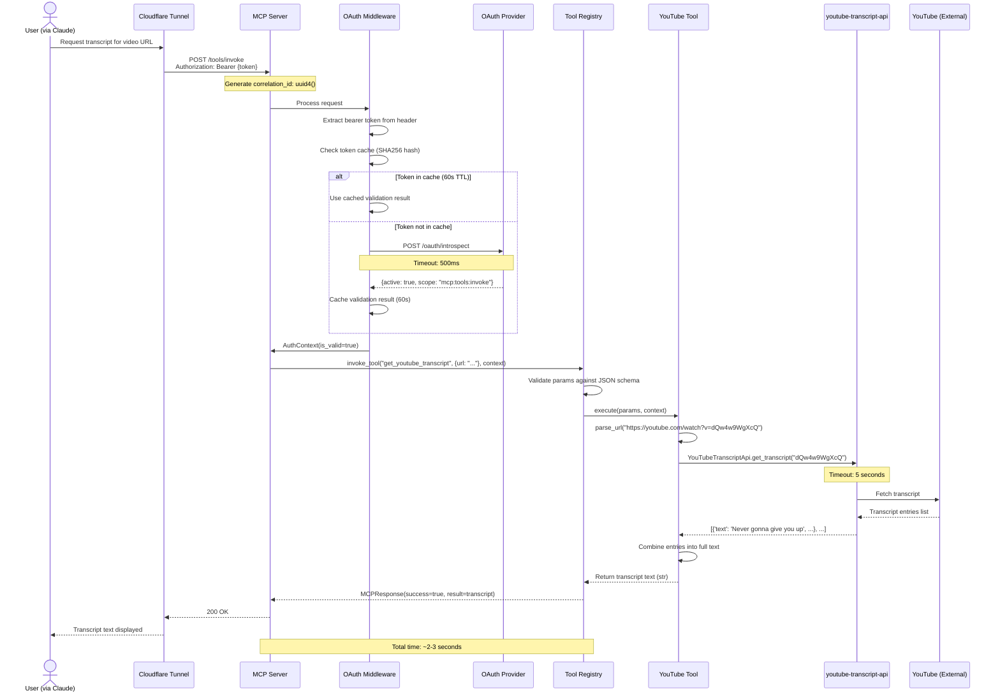
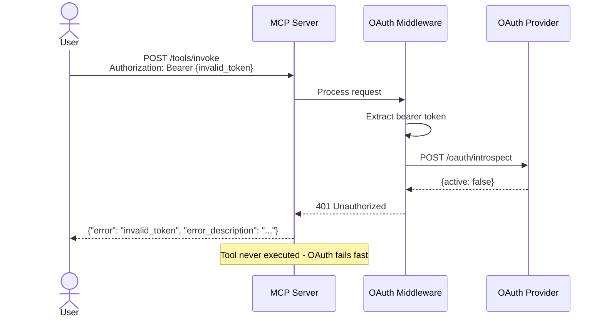
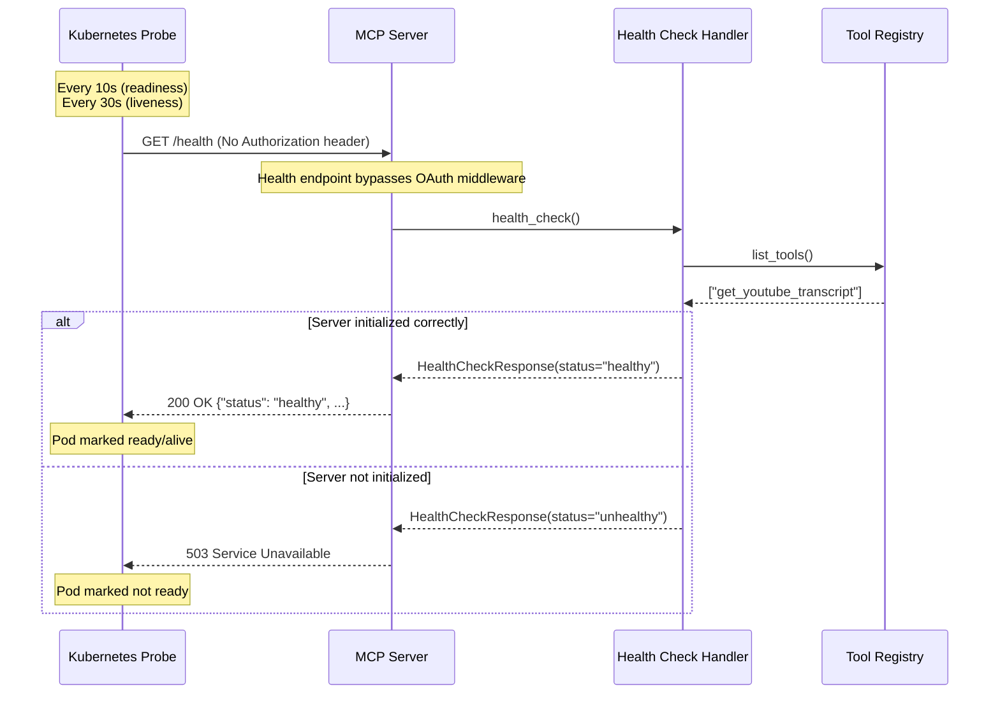

# youtubeagenttranscript Architecture Document

**Version:** 1.0
**Date:** 2025-11-21
**Status:** Final Draft

---

## Change Log

| Date | Version | Description | Author |
|------|---------|-------------|--------|
| 2025-11-21 | 1.0 | Initial architecture document creation | Winston (Architect) |

---

## Introduction

This document outlines the overall project architecture for **youtubeagenttranscript**, including backend systems, shared services, and non-UI specific concerns. Its primary goal is to serve as the guiding architectural blueprint for AI-driven development, ensuring consistency and adherence to chosen patterns and technologies.

**Relationship to Frontend Architecture:**
This is a backend-only MCP server tool with no graphical user interface. All user interaction occurs through Claude/MCP clients (external systems). No separate Frontend Architecture Document is required.

### Starter Template or Existing Project

**Decision: N/A**

This is a greenfield Python 3.12+ project using standard project structure conventions. Manual setup will handle MCP SDK integration, tool registry architecture, and all tooling configuration.

---

## High Level Architecture

### Technical Summary

The youtubeagenttranscript system is a **stateless, plugin-based MCP server** built in Python 3.12+, exposing YouTube transcript retrieval as an MCP-native tool for AI agents like Claude. The architecture uses a **tool registry pattern** to enable extensible tool addition (future Vimeo, TikTok, podcast support) without server restructuring. Core components include: MCP protocol handler (using official Anthropic SDK), OAuth 2.0 middleware (authlib), tool registry with dynamic schema generation, and pluggable tool modules (YouTube via youtube-transcript-api). The system is containerized with Docker, deployed to Kubernetes, and exposed via Cloudflare Tunnel for secure remote access, directly supporting the PRD's goals of zero-friction MCP integration, self-hosted deployment with remote access, and extensible multi-platform architecture.

### High Level Overview

**1. Architectural Style: Plugin-Based Stateless Service**

A single containerized Python application with an extensible tool registry system. Not a traditional microservices architecture, but rather a **modular monolith with runtime plugin registration**. Each tool (e.g., YouTube, future platforms) is an independent module implementing a standard interface, registered at server startup.

**2. Repository Structure: Monorepo**

Single Git repository containing:
- Python MCP server code (src/)
- Tool implementations (src/tools/)
- Kubernetes manifests (k8s/)
- Dockerfile and container configuration
- Documentation (docs/)
- Tests (tests/)

**3. Service Architecture: Single MCP Server with Tool Registry**

One Python process handling:
- MCP protocol communication
- OAuth 2.0 bearer token validation
- HTTP health check endpoint
- Dynamic tool registration and invocation routing
- Structured JSON logging

**4. Primary User Interaction Flow:**

```
User (Claude)
  → Cloudflare Tunnel (HTTPS, public URL)
    → Kubernetes Service (ClusterIP)
      → MCP Server Pod (OAuth validation)
        → Tool Registry (route to handler)
          → YouTube Tool (youtube-transcript-api)
            → YouTube API (transcript extraction)
              → Response (transcript text)
```

**5. Key Architectural Decisions:**

| Decision | Rationale |
|----------|-----------|
| **Python over TypeScript/Go** | Mature youtube-transcript-api library, official MCP Python SDK, excellent OAuth ecosystem (authlib), team familiarity |
| **Tool Registry Pattern** | Enables adding Vimeo/TikTok/podcasts without refactoring core server; minimal overhead now vs. major work later |
| **Stateless Design (No Database)** | Simplifies deployment, enables horizontal scaling, meets NFR12; transcripts fetched on-demand per PRD scope |
| **OAuth 2.0 (not API keys)** | Matches Claude's native auth flow, industry-standard security, token expiration/revocation support |
| **Cloudflare Tunnel (not ngrok/Tailscale)** | Zero-trust architecture, free tier sufficient, automatic HTTPS, K8s-friendly, reliable uptime |
| **Kubernetes (not serverless)** | Local cluster control, no cold starts (NFR1: <5s response), simpler OAuth integration, 99%+ uptime (NFR4) |

### High Level Project Diagram

```mermaid
graph TB
    User[Claude/MCP Client]

    subgraph Internet
        Tunnel[Cloudflare Tunnel<br/>HTTPS Public URL]
    end

    subgraph Kubernetes Cluster
        TunnelPod[cloudflared Pod]
        Service[MCP Server Service<br/>ClusterIP:8080]

        subgraph MCP Server Pod
            OAuth[OAuth 2.0 Middleware]
            MCP[MCP Protocol Handler]
            Registry[Tool Registry]

            subgraph Tools
                YT[YouTube Tool]
                Future1[Future: Vimeo Tool]
                Future2[Future: Podcast Tool]
            end
        end

        Health[/health endpoint]
    end

    subgraph External Services
        YouTube[YouTube API<br/>youtube-transcript-api]
        OAuthProvider[OAuth Provider<br/>Token Validation]
    end

    User -->|HTTPS Request + OAuth Token| Tunnel
    Tunnel --> TunnelPod
    TunnelPod --> Service
    Service --> OAuth
    OAuth -->|Validate Token| OAuthProvider
    OAuth -->|Authorized| MCP
    MCP --> Registry
    Registry -->|Route to Tool| YT
    YT -->|Fetch Transcript| YouTube

    Service -.->|K8s Probes| Health

    Future1 -.->|Phase 2| Registry
    Future2 -.->|Phase 2| Registry

    style YT fill:#90EE90
    style Future1 fill:#FFE4B5
    style Future2 fill:#FFE4B5
    style OAuth fill:#FFA07A
```

### Architectural and Design Patterns

**1. Service Architecture Pattern: Plugin-Based Monolith (Recommended)**

- Single Python process with tool registry for runtime plugin loading
- Tools share process, memory, and infrastructure
- _Rationale:_ Personal project with 1-5 tools expected; microservices overhead unjustified; PRD specifies single containerized server; simpler to operate and maintain; can refactor to microservices later if tool count exceeds 10+

**2. Tool Registration Pattern: Abstract Base Class with Runtime Registry**

- Each tool extends `BaseMCPTool` abstract class
- Tools register themselves in a centralized `ToolRegistry` on import
- Registry validates schema and provides lookup by tool name
- _Rationale:_ Enforces interface contract, enables dynamic schema generation for MCP, type-safe in Python with protocols/ABC, testable in isolation

**3. Authentication Pattern: Middleware-Based OAuth 2.0 Bearer Token Validation**

- ASGI/WSGI middleware intercepts all requests before tool invocation
- Extracts Authorization header, validates bearer token with OAuth provider
- Returns 401 for missing/invalid tokens before reaching MCP handler
- _Rationale:_ Separation of concerns (auth vs. business logic), consistent enforcement across all tools, matches Claude's OAuth flow per PRD

**4. Communication Pattern: Request/Response (Synchronous HTTP)**

- MCP tools exposed via HTTP endpoints using official MCP SDK
- Client sends tool invocation request, server responds with result
- No WebSockets, no streaming (MVP scope)
- _Rationale:_ Aligns with MCP protocol specification, simpler than async/streaming, meets <5s response time requirement for transcripts

**5. Error Handling Pattern: Structured Exception Hierarchy with Correlation IDs**

- Custom exception classes (e.g., `ToolExecutionError`, `AuthenticationError`, `YouTubeAPIError`)
- Global exception handler converts to standardized JSON responses
- Every request gets unique correlation ID for log tracing
- _Rationale:_ Consistent error format for MCP clients, debuggability via logs, follows PRD Story 2.2 requirements

**6. Logging Pattern: Structured JSON Logging (stdout/stderr)**

- All logs output as JSON with: timestamp, level, message, correlation_id, context
- Uses structlog library for structured log building
- Kubernetes captures stdout/stderr for centralized log aggregation
- _Rationale:_ Machine-parseable for monitoring tools, correlation ID tracing, K8s-native pattern, meets NFR requirements

**7. Configuration Management Pattern: 12-Factor Environment Variables**

- All configuration via environment variables (OAuth credentials, ports, endpoints)
- Kubernetes Secrets for sensitive data (OAuth client secret, tunnel token)
- ConfigMaps for non-sensitive config
- _Rationale:_ Cloud-native best practice, K8s-friendly, no secrets in code/images, environment-specific config

**8. Deployment Pattern: Tunnel as Separate Deployment (Recommended)**

- Cloudflare Tunnel runs in separate K8s Deployment
- Routes to MCP Server Service via internal ClusterIP
- _Rationale:_ Operational flexibility, tunnel issues don't affect server health checks, aligns with PRD's recommendation in Story 2.4, minimal resource overhead difference

---

## Tech Stack

### Cloud Infrastructure

- **Provider:** Local Kubernetes Cluster (k3s/minikube/kind for development, standard K8s for production)
- **Key Services:**
  - Kubernetes (container orchestration, health probes, service discovery)
  - Cloudflare Tunnel (remote access, automatic HTTPS, zero-trust networking)
- **Deployment Regions:** Local cluster (user's infrastructure)

### Technology Stack Table

| Category | Technology | Version | Purpose | Rationale |
|----------|-----------|---------|---------|-----------|
| **Language** | Python | 3.12 | Primary development language | Stable release, excellent library ecosystem, async support, MCP SDK compatibility |
| **Runtime** | CPython | 3.12 | Python interpreter | Standard implementation, best compatibility |
| **ASGI Server** | Uvicorn | 0.30+ | HTTP server for MCP endpoints | Industry standard for async Python, production-ready, lightweight, excellent performance |
| **MCP SDK** | mcp (Anthropic) | Latest | MCP protocol implementation | Official SDK, handles protocol details, schema generation support |
| **YouTube Library** | youtube-transcript-api | 0.6+ | Transcript extraction | Mature, actively maintained, handles multiple transcript scenarios, no API key required |
| **OAuth Library** | authlib | 1.3+ | OAuth 2.0 token validation | Standards-compliant, supports bearer tokens, widely used, secure |
| **Logging** | structlog | 24.1+ | Structured JSON logging | Machine-parseable logs, correlation ID support, K8s-friendly stdout logging |
| **HTTP Client** | httpx | 0.27+ | HTTP requests (OAuth validation) | Async support, modern API, better than requests for async contexts |
| **Testing Framework** | pytest | 8.0+ | Unit and integration testing | Industry standard, rich plugin ecosystem, fixture support |
| **Test Mocking** | pytest-mock | 3.12+ | Mocking for unit tests | Simplifies mocking, integrates with pytest |
| **Async Testing** | pytest-asyncio | 0.23+ | Testing async code | Required for async test cases with Uvicorn/ASGI |
| **Code Formatter** | black | 24.0+ | Automatic code formatting | Opinionated formatter, eliminates style debates, AI-agent friendly |
| **Linter** | ruff | 0.3+ | Fast Python linter | Replaces flake8/pylint/isort, extremely fast, comprehensive rules |
| **Type Checker** | mypy | 1.9+ | Static type checking | Catches type errors, improves code quality, IDE support |
| **Container Base** | python:3.12-slim | 3.12 | Docker base image | Debian-based, ~150MB, production-ready, avoids Alpine C-extension issues |
| **Container Runtime** | Docker | 24+ | Container building and local testing | Industry standard, K8s-compatible images |
| **Orchestration** | Kubernetes | 1.28+ | Container orchestration | Health probes, service discovery, rolling updates, declarative deployment |
| **Tunnel Solution** | Cloudflare Tunnel (cloudflared) | Latest | Remote HTTPS access | Zero-trust networking, free tier, automatic TLS, K8s-friendly |
| **Package Manager** | pip | 24+ | Python dependency management | Standard tool, pyproject.toml support |
| **Build Tool** | pyproject.toml | N/A | Modern Python project config | PEP 518 standard, consolidates dependencies and tool config |
| **Dependency Management** | pip-tools | 7+ | Lock file generation (pip-compile) | Reproducible builds, separates abstract deps from pinned versions |

### Development Tools

| Category | Technology | Version | Purpose | Rationale |
|----------|-----------|---------|---------|-----------|
| **Version Control** | Git | 2.40+ | Source control | Industry standard |
| **Container Registry** | Docker Hub / Local | N/A | Image storage | Free tier sufficient, or local registry for privacy |
| **IDE Support** | Python Language Server | N/A | Editor integration | VSCode, PyCharm support for type hints and linting |

### Configuration & Secrets

- **Configuration Method:** Environment variables (12-factor app pattern)
- **Development Secrets:** `.env` file (gitignored) loaded via python-dotenv
- **Production Secrets:** Kubernetes Secrets for OAuth credentials, tunnel tokens
- **Non-sensitive Config:** Kubernetes ConfigMaps for ports, URLs, log levels

### 🚨 CRITICAL: This Tech Stack is Definitive

**All development agents, documentation, and implementation MUST use these exact technologies and versions.**

Any deviation requires:
1. Architecture document update
2. Explicit approval
3. Justification for the change

---

## Data Models

**Note:** This is a **stateless service with no persistent database** (per PRD NFR10, NFR12). The models below are **in-memory Python data structures** (using `dataclasses` or `pydantic` models) representing runtime objects, MCP protocol messages, and tool registration metadata.

### MCPToolDefinition

**Purpose:** Represents a registered MCP tool's metadata in the tool registry. Each tool (YouTube, future Vimeo, etc.) creates one instance at server startup.

**Key Attributes:**
- `name`: str - Unique tool identifier (e.g., "get_youtube_transcript")
- `description`: str - Human-readable tool description for MCP schema
- `input_schema`: dict - JSON Schema defining tool input parameters
- `handler`: Callable - Async function that executes tool logic
- `version`: str - Tool version for API evolution (default "1.0")

**Relationships:**
- Registered with `ToolRegistry` at server startup
- Handler invoked by MCP server when tool is called

### MCPRequest

**Purpose:** Represents an incoming MCP tool invocation request from a client (e.g., Claude).

**Key Attributes:**
- `tool_name`: str - Name of tool to invoke
- `parameters`: dict - Tool-specific input parameters
- `correlation_id`: str - Unique request ID for log tracing
- `auth_context`: Optional[AuthContext] - OAuth validation result

### MCPResponse

**Purpose:** Represents a tool execution result returned to the MCP client.

**Key Attributes:**
- `success`: bool - Whether tool execution succeeded
- `result`: Optional[Any] - Tool output data (if successful)
- `error`: Optional[ErrorDetail] - Error information (if failed)
- `correlation_id`: str - Matches request correlation ID
- `execution_time_ms`: int - Execution duration for performance monitoring

### ErrorDetail

**Purpose:** Standardized error information structure for consistent error responses.

**Key Attributes:**
- `error_code`: str - Machine-readable error code
- `message`: str - Human-readable error description
- `details`: Optional[dict] - Additional context
- `correlation_id`: str - Request correlation ID for log lookup

### AuthContext

**Purpose:** OAuth token validation result, attached to authenticated requests.

**Key Attributes:**
- `is_valid`: bool - Whether token passed validation
- `token_hash`: str - SHA256 hash of token (for logging, never log raw token)
- `scopes`: list[str] - OAuth scopes granted by token
- `expires_at`: Optional[datetime] - Token expiration time
- `client_id`: Optional[str] - OAuth client identifier

### YouTubeTranscriptEntry

**Purpose:** Represents a single transcript segment from YouTube's transcript data.

**Key Attributes:**
- `text`: str - Transcript text content
- `start`: float - Start time in seconds
- `duration`: float - Segment duration in seconds

### YouTubeURL

**Purpose:** Parsed YouTube URL with extracted video ID.

**Key Attributes:**
- `raw_url`: str - Original URL provided by user
- `video_id`: str - Extracted YouTube video ID (11 characters)
- `url_format`: str - Detected format ("youtube.com" or "youtu.be")

### ToolExecutionContext

**Purpose:** Runtime context passed to tool handlers containing request metadata and utilities.

**Key Attributes:**
- `correlation_id`: str - Request correlation ID
- `logger`: structlog.BoundLogger - Logger with correlation ID pre-bound
- `auth_context`: AuthContext - OAuth validation result
- `start_time`: datetime - Request start time for duration calculation

### HealthCheckResponse

**Purpose:** Simple health check status for Kubernetes probes.

**Key Attributes:**
- `status`: str - "healthy" or "unhealthy"
- `timestamp`: datetime - Health check time
- `version`: str - Server version/commit hash
- `registered_tools`: list[str] - Names of registered tools

---

## Components

Based on the **plugin-based modular monolith** architecture, repository structure (monorepo), and tech stack (Python 3.12, Uvicorn, MCP SDK), here are the major logical components:

### MCP Server Component

**Responsibility:** Core ASGI application handling HTTP requests, MCP protocol communication, request routing, and server lifecycle management.

**Key Interfaces:**
- `POST /tools/invoke` - MCP tool invocation endpoint (requires OAuth)
- `GET /health` - Health check endpoint (no auth required)
- `startup_event()` - Initialize tool registry, load configuration
- `shutdown_event()` - Graceful cleanup

**Dependencies:** ToolRegistry, OAuthMiddleware, LoggingUtility, MCP SDK

**Technology Stack:** Uvicorn, MCP Python SDK, structlog

**Module Location:** `src/server.py`

### OAuth Middleware Component

**Responsibility:** Intercept all incoming requests (except `/health`), validate OAuth 2.0 bearer tokens, attach AuthContext to requests, reject unauthorized access.

**Key Interfaces:**
- `async def oauth_middleware(request, call_next)` - ASGI middleware function
- `async def validate_token(token)` - Token validation logic
- `get_token_from_header(headers)` - Extract bearer token

**Dependencies:** authlib, httpx, LoggingUtility

**Technology Stack:** authlib, httpx, Pydantic

**Module Location:** `src/middleware/oauth.py`

### Tool Registry Component

**Responsibility:** Central registry managing all MCP tools, validating tool definitions, providing tool lookup by name, generating MCP schema for clients.

**Key Interfaces:**
- `register_tool(tool)` - Register new tool at startup
- `get_tool(name)` - Retrieve tool by name
- `list_tools()` - Get all registered tools
- `generate_mcp_schema()` - Generate MCP tools schema
- `async def invoke_tool(...)` - Execute tool handler

**Dependencies:** BaseMCPTool, ErrorHandler, LoggingUtility

**Technology Stack:** Python, jsonschema

**Module Location:** `src/registry/tool_registry.py`

### Base Tool Interface Component

**Responsibility:** Abstract base class defining contract all MCP tools must implement.

**Key Interfaces:**
- `@abstractmethod def get_name()` - Tool identifier
- `@abstractmethod def get_description()` - Tool description
- `@abstractmethod def get_input_schema()` - JSON Schema for parameters
- `@abstractmethod async def execute(...)` - Tool execution logic

**Dependencies:** jsonschema, Pydantic models

**Technology Stack:** Python ABC, jsonschema

**Module Location:** `src/tools/base.py`

### YouTube Tool Component

**Responsibility:** Implement YouTube transcript extraction, URL parsing and validation, error handling for YouTube-specific scenarios.

**Key Interfaces:**
- Implements `BaseMCPTool` interface
- `async def execute(params, context)` - Fetch and return transcript
- `parse_url(url)` - Extract video ID from URL
- `async def fetch_transcript(video_id)` - Call youtube-transcript-api

**Dependencies:** BaseMCPTool, youtube-transcript-api, YouTubeURL model, ErrorHandler

**Technology Stack:** youtube-transcript-api, Pydantic

**Module Location:** `src/tools/youtube_tool.py`

### Error Handler Component

**Responsibility:** Global exception handling, convert Python exceptions to standardized ErrorDetail models, map exception types to HTTP status codes.

**Key Interfaces:**
- `handle_exception(exc, correlation_id)` - Convert exception to ErrorDetail
- `get_http_status(error_code)` - Map error codes to HTTP status
- Custom exception classes (ToolExecutionError, AuthenticationError, InvalidInputError, etc.)

**Dependencies:** ErrorDetail model, LoggingUtility

**Technology Stack:** Python, Pydantic

**Module Location:** `src/utils/errors.py`

### Logging Utility Component

**Responsibility:** Configure structured JSON logging, bind correlation IDs to logger contexts, provide pre-configured loggers to components.

**Key Interfaces:**
- `configure_logging(log_level)` - Initialize structlog at startup
- `get_logger(name)` - Get module-specific logger
- `bind_correlation_id(correlation_id)` - Create request-scoped logger
- `sanitize_log_data(data)` - Remove sensitive fields

**Dependencies:** structlog, Python logging

**Technology Stack:** structlog

**Module Location:** `src/utils/logging.py`

### Health Check Handler Component

**Responsibility:** Provide Kubernetes liveness/readiness probe endpoint.

**Key Interfaces:**
- `async def health_check()` - Return health status
- `check_dependencies()` - Verify tool registry initialized

**Dependencies:** ToolRegistry, HealthCheckResponse model

**Technology Stack:** Python, Pydantic

**Module Location:** `src/handlers/health.py`

### Configuration Component

**Responsibility:** Load and validate configuration from environment variables.

**Key Interfaces:**
- `class Config(BaseSettings)` - Pydantic settings model
- `get_config()` - Singleton config instance

**Dependencies:** pydantic-settings, python-dotenv

**Technology Stack:** Pydantic BaseSettings

**Module Location:** `src/config.py`

---

## External APIs

### YouTube Transcript API (via youtube-transcript-api)

**Purpose:** Retrieve official YouTube video transcripts/captions without requiring API keys.

**Documentation:**
- Library: https://github.com/jdepoix/youtube-transcript-api
- PyPI: https://pypi.org/project/youtube-transcript-api/

**Base URL(s):** The `youtube-transcript-api` library abstracts the actual YouTube endpoints (undocumented API)

**Authentication:** None required

**Rate Limits:** No official rate limits published; recommend client-side rate limiting (max 10 requests/minute)

**Integration Notes:**

**Error Scenarios:**

| Error Type | Library Exception | Our Error Code | HTTP Status | Handling |
|------------|------------------|----------------|-------------|----------|
| Video not found | `VideoUnavailable` | `video_not_found` | 404 | Return clear error |
| No transcript available | `NoTranscriptFound` | `transcript_unavailable` | 404 | Return error with explanation |
| Invalid video ID | `InvalidVideoId` | `invalid_url` | 400 | Return validation error |
| Network timeout | `requests.Timeout` | `network_error` | 503 | Retry up to 2 times |
| Rate limited | Various (403/429) | `youtube_api_error` | 503 | Retry with backoff |

**Performance:** Average 1-3 seconds, 5s timeout configured (NFR1)

**Compliance:** Personal use allowed under YouTube TOS; no redistribution or storage

### OAuth 2.0 Token Validation Service

**Purpose:** Validate OAuth 2.0 bearer tokens provided by MCP clients (Claude).

**Documentation:** OAuth 2.0 Token Introspection (RFC 7662)

**Base URL(s):** Configured via `OAUTH_TOKEN_ENDPOINT` environment variable

**Authentication:** Client credentials (client ID and client secret)

**Rate Limits:** Unknown; mitigated with 60-second token cache

**Integration Notes:**

Token validation cached for 60 seconds (in-memory) to reduce OAuth provider load and improve performance (NFR14: <500ms).

**Error Scenarios:**

| Error Type | HTTP Status | Our Handling |
|------------|-------------|--------------|
| Invalid token | 200 OK (active=false) | Return 401 to client |
| OAuth provider down | 503 Service Unavailable | Return 503, log error |
| Timeout (>500ms) | Timeout exception | Return 503, log warning |

**Performance:** Target <500ms validation time (NFR14); cache hit <1ms

---

## Core Workflows

### Workflow 1: Successful YouTube Transcript Retrieval (Happy Path)



### Workflow 2: OAuth Authentication Failure



### Workflow 3: Health Check (Kubernetes Probes)



---

## MCP Server API Specification

### Base Information

**Base URL:**
- Local: `http://localhost:8080`
- Kubernetes (internal): `http://mcp-server:8080`
- Cloudflare Tunnel (public): `https://mcp-server.example.com`

**Protocol:** HTTP/1.1 (HTTPS enforced for public access)

**Content-Type:** `application/json`

**Authentication:** OAuth 2.0 Bearer Token (except `/health`)

### Endpoints

#### POST /tools/invoke

**Purpose:** Invoke a registered MCP tool

**Authentication:** Required (OAuth 2.0 Bearer Token)

**Request:**
```json
{
  "tool": "get_youtube_transcript",
  "parameters": {
    "url": "https://www.youtube.com/watch?v=dQw4w9WgXcQ"
  }
}
```

**Success Response (200 OK):**
```json
{
  "success": true,
  "result": "Never gonna give you up...",
  "correlation_id": "550e8400-e29b-41d4-a716-446655440000",
  "execution_time_ms": 1847
}
```

**Error Response (400 Bad Request):**
```json
{
  "success": false,
  "error": {
    "error_code": "invalid_url",
    "message": "Invalid YouTube URL format...",
    "correlation_id": "550e8400-e29b-41d4-a716-446655440000"
  }
}
```

**Status Codes:**

| Code | Meaning |
|------|---------|
| 200 | Tool executed successfully |
| 400 | Invalid parameters |
| 401 | Missing or invalid OAuth token |
| 404 | Tool not found or transcript unavailable |
| 500 | Internal server error |
| 503 | External service unavailable |

#### GET /health

**Purpose:** Kubernetes liveness/readiness probe

**Authentication:** None required

**Success Response (200 OK):**
```json
{
  "status": "healthy",
  "timestamp": "2025-11-21T14:32:15.123Z",
  "version": "1.0.0",
  "registered_tools": ["get_youtube_transcript"]
}
```

### Error Code Reference

| Error Code | HTTP Status | Description |
|------------|-------------|-------------|
| `invalid_token` | 401 | OAuth token invalid or expired |
| `missing_token` | 401 | Authorization header not present |
| `invalid_url` | 400 | YouTube URL format invalid |
| `invalid_input` | 400 | Required parameters missing |
| `tool_not_found` | 404 | Requested tool not registered |
| `transcript_unavailable` | 404 | Video has no transcript |
| `video_not_found` | 404 | YouTube video does not exist |
| `network_error` | 503 | Failed to connect to YouTube |
| `youtube_api_error` | 503 | YouTube service error |
| `internal_error` | 500 | Unexpected server error |

---

## Database Schema

**No persistent database required for this architecture.**

This MCP server follows a **fully stateless design** per PRD requirements NFR10 and NFR12.

**Data Storage Strategy:**

| Data Type | Storage Approach | Lifetime |
|-----------|-----------------|----------|
| YouTube Transcripts | Not stored | Request-only |
| OAuth Tokens | In-memory cache only | 60 seconds |
| Request Correlation IDs | Logs only (stdout) | Until log rotation |
| Tool Registry | In-memory (loaded at startup) | Server lifetime |
| Server Configuration | Environment variables | Server lifetime |

---

## Source Tree

```
youtubeagenttranscript/
├── .github/
│   └── workflows/
│       ├── ci.yml
│       └── deploy.yml
│
├── docs/
│   ├── architecture.md
│   ├── prd.md
│   ├── DEPLOYMENT.md
│   └── DEVELOPMENT.md
│
├── k8s/
│   ├── base/
│   │   ├── deployment.yaml
│   │   ├── service.yaml
│   │   ├── configmap.yaml
│   │   └── secret.yaml.example
│   ├── cloudflare-tunnel/
│   │   ├── deployment.yaml
│   │   ├── configmap.yaml
│   │   └── secret.yaml.example
│   └── kustomization.yaml
│
├── src/
│   ├── __init__.py
│   ├── __main__.py
│   ├── server.py
│   ├── config.py
│   │
│   ├── middleware/
│   │   ├── __init__.py
│   │   └── oauth.py
│   │
│   ├── registry/
│   │   ├── __init__.py
│   │   └── tool_registry.py
│   │
│   ├── tools/
│   │   ├── __init__.py
│   │   ├── base.py
│   │   ├── youtube_tool.py
│   │   └── _template_tool.py
│   │
│   ├── models/
│   │   ├── __init__.py
│   │   ├── mcp.py
│   │   ├── auth.py
│   │   ├── errors.py
│   │   └── youtube.py
│   │
│   ├── handlers/
│   │   ├── __init__.py
│   │   └── health.py
│   │
│   └── utils/
│       ├── __init__.py
│       ├── logging.py
│       ├── errors.py
│       └── cache.py
│
├── tests/
│   ├── __init__.py
│   ├── conftest.py
│   │
│   ├── unit/
│   │   ├── test_youtube_tool.py
│   │   ├── test_tool_registry.py
│   │   ├── test_oauth_middleware.py
│   │   └── test_error_handling.py
│   │
│   ├── integration/
│   │   ├── test_mcp_workflow.py
│   │   ├── test_oauth_flow.py
│   │   └── test_youtube_api.py
│   │
│   └── fixtures/
│       ├── mock_transcripts.json
│       └── mock_oauth_responses.json
│
├── scripts/
│   ├── setup-dev-env.sh
│   ├── run-local.sh
│   ├── create-k8s-secrets.sh
│   └── test-coverage.sh
│
├── .env.example
├── .gitignore
├── .dockerignore
├── Dockerfile
├── pyproject.toml
├── requirements.txt
├── requirements-dev.txt
├── README.md
└── CHANGELOG.md
```

---

## Infrastructure and Deployment

### Infrastructure as Code

**Tool:** Kubernetes YAML Manifests

**Location:** `/k8s` directory

**Approach:** Manifest-based IaC - Kubernetes resources defined as YAML files in version control

### Deployment Strategy

**Strategy:** Rolling Updates (Zero-Downtime Deployments)

**Configuration:**
- **Replicas:** 2 (minimum for zero-downtime)
- **Rolling Update:** maxUnavailable: 0, maxSurge: 1
- **Resource Limits:** 512MB memory, 500m CPU per pod (NFR6)
- **Health Probes:** Liveness (30s), Readiness (10s)

### CI/CD Platform

**Platform:** GitHub Actions

**CI Pipeline Stages:**
1. Run tests (pytest with coverage)
2. Run linters (ruff, black, mypy)
3. Build Docker image
4. Test Docker image health

**CD Pipeline Triggers:** Git tag creation (e.g., `v1.0.0`)

**CD Pipeline Stages:**
1. Build and tag Docker image
2. Push to Docker registry
3. Update Kubernetes manifest
4. Deploy to Kubernetes
5. Verify deployment

### Environments

#### Development (Local)
- Docker Desktop with Kubernetes, or Minikube/k3s
- Environment variables via `.env` file
- Local port: `http://localhost:8080`

#### Production
- Kubernetes cluster (2 MCP server pods, 1 tunnel pod)
- OAuth credentials: Kubernetes Secret
- Tunnel token: Kubernetes Secret
- Public URL: `https://mcp-server.yourdomain.com`
- Resource allocation: ~1.2GB memory total

### Rollback Strategy

**Primary Method:** Kubernetes Rollback

```bash
# Rollback to previous version
kubectl rollout undo deployment/mcp-server

# Rollback to specific revision
kubectl rollout undo deployment/mcp-server --to-revision=3
```

**Recovery Time Objective (RTO):** 5 minutes

**Trigger Conditions:**
- Health check failures
- High error rate (>5%)
- Performance degradation (>5s response)
- Critical bug discovered

---

## Error Handling Strategy

### General Approach

**Error Model:** Structured Exception Hierarchy with Standardized Error Responses

**Core Principles:**
1. Fail Fast - Validate inputs early
2. Fail Gracefully - Convert all exceptions to user-friendly messages
3. Never Fail Silently - All errors logged with full context
4. Security First - No sensitive data in errors or logs
5. Correlation Traceability - Every error includes correlation_id

### Exception Hierarchy

```python
class MCPServerError(Exception):
    """Base exception for all MCP server errors"""

class ClientError(MCPServerError):
    """Client-side errors (400-level)"""
    http_status = 400

class InvalidInputError(ClientError):
    """Invalid parameters"""

class InvalidURLError(ClientError):
    """Invalid YouTube URL"""

class AuthenticationError(MCPServerError):
    """OAuth authentication failed (401)"""
    http_status = 401

class ResourceNotFoundError(ClientError):
    """Resource not found (404)"""
    http_status = 404

class ServerError(MCPServerError):
    """Server-side errors (500-level)"""
    http_status = 500

class ExternalServiceError(ServerError):
    """External service unavailable (503)"""
    http_status = 503
```

### Logging Standards

**Library:** structlog (structured JSON logging)

**Format:** Every log entry is JSON to stdout/stderr

**Log Levels:**
- **DEBUG:** Detailed diagnostic information
- **INFO:** Normal operation events
- **WARNING:** Recoverable issues, degraded performance
- **ERROR:** Error conditions that were handled
- **CRITICAL:** Severe errors requiring immediate attention

**Required Context:**
- `correlation_id` - UUID per request (mandatory)
- `timestamp` - ISO 8601 format
- `level` - Log level
- `event` - Short event name

**NEVER LOG:**
- Raw OAuth tokens (hash only)
- OAuth client secrets
- Authorization headers
- User PII

### Error Handling Patterns

**Retry Policy (YouTube API):**
- Max 2 retries
- Exponential backoff: 1s, 2s
- Only retry transient errors (timeouts, 429, 503)
- Never retry permanent errors (400, 404, 401)

**Timeout Configuration:**
- YouTube transcript fetch: 5s
- OAuth token validation: 500ms
- Health check: 3s

**Error Response Format:**
```json
{
  "success": false,
  "error": {
    "error_code": "string",
    "message": "string",
    "details": {},
    "correlation_id": "uuid"
  },
  "execution_time_ms": 123
}
```

---

## Coding Standards

⚠️ **These standards are MANDATORY for AI development agents.**

### Core Standards

**Languages & Runtimes:**
- Python 3.12 - Required version
- Type hints mandatory for all function signatures
- Async-first for all I/O operations

**Style & Linting:**
- Formatter: `black` (100-character line length)
- Linter: `ruff` - must pass with no errors
- Type Checker: `mypy --strict` - must pass

**Test Organization:**
- Test file naming: `test_{module_name}.py`
- Test location: Unit tests in `tests/unit/`, integration in `tests/integration/`

### Critical Rules

**1. Logging: Never use print()**
```python
# ❌ WRONG
print("Transcript retrieved")

# ✅ CORRECT
logger.info("transcript_retrieved", video_id=video_id)
```

**2. Error Handling: Always include correlation_id**
```python
# ✅ CORRECT
raise InvalidURLError(url)  # Exception includes correlation_id
```

**3. Security: Never log sensitive data**
```python
# ❌ WRONG
logger.info("auth_attempt", token=bearer_token)

# ✅ CORRECT
logger.info("auth_attempt", token_hash=hashlib.sha256(bearer_token.encode()).hexdigest())
```

**4. Async/Await: All I/O operations must be async**
```python
# ✅ CORRECT
async def fetch_transcript(video_id: str):
    async with httpx.AsyncClient() as client:
        response = await client.get(url)
```

**5. Type Hints: All public functions must have complete type hints**
```python
# ✅ CORRECT
def parse_url(url: str) -> str:
    return extract_video_id(url)
```

**6. Configuration: Never hardcode secrets**
```python
# ✅ CORRECT
from src.config import get_config
config = get_config()
client_secret = config.oauth_client_secret
```

**7. Imports: Always use absolute imports**
```python
# ✅ CORRECT
from src.models.mcp import MCPRequest
from src.tools.base import BaseMCPTool
```

**8. Testing: All new code must have tests**
- Minimum 80% code coverage
- Tests for happy path, error cases, and edge cases

**9. Retry Logic: Only retry transient errors**
- Transient: Network timeouts, 429, 503
- Permanent: 400, 404, 401 - fail immediately

**10. Correlation ID: Thread through all function calls**
```python
# ✅ CORRECT
async def execute(params: dict, context: ToolExecutionContext):
    context.logger.info("tool_started")  # correlation_id included
```

---

## Test Strategy and Standards

### Testing Philosophy

**Approach:** Test-After with AI Agent Test Generation

**Coverage Goals:**
- Unit Tests: 80% minimum
- Integration Tests: Critical workflows
- E2E Tests: Manual with real Claude/MCP client

**Test Pyramid:**
- 70% Unit Tests (fast, isolated, mocked)
- 20% Integration Tests (multi-component)
- 10% E2E Tests (manual validation)

### Test Types

#### Unit Tests

**Framework:** pytest 8.0+

**File Convention:** `tests/unit/test_{module_name}.py`

**Coverage:** 80% minimum per module

**Requirements:**
- Mock all external dependencies
- Use AAA pattern (Arrange, Act, Assert)
- Test happy path, error cases, edge cases
- Mark async tests with `@pytest.mark.asyncio`

**Example:**
```python
class TestYouTubeTool:
    def test_parse_youtube_url_standard_format(self, youtube_tool):
        url = "https://www.youtube.com/watch?v=dQw4w9WgXcQ"
        result = youtube_tool.parse_url(url)
        assert result.video_id == "dQw4w9WgXcQ"
```

#### Integration Tests

**Scope:** Multi-component interactions

**Location:** `tests/integration/`

**Test Infrastructure:**
- YouTube API: Real HTTP calls to known test videos
- OAuth Provider: Mock OAuth server
- MCP Protocol: Real HTTP requests

#### E2E Tests

**Approach:** Manual testing (no automation in MVP)

**Test Cases:**
- Happy path with real Claude
- Error handling (invalid URL, no transcript)
- Remote access via Cloudflare Tunnel
- Performance validation (<5s response time)

### CI Integration

Tests run in GitHub Actions on every push/PR:
- Unit tests with coverage report
- Integration tests
- Coverage threshold check (≥80%)

---

## Security

⚠️ **These security requirements are MANDATORY.**

### Input Validation

**Validation Library:** Pydantic

**Validation Location:** API boundary (before processing)

**Rules:**
- All external inputs MUST be validated
- Validation at API boundary (not deep in code)
- Whitelist approach (not blacklist)
- URL validation with strict regex
- Parameter type validation (no `Any` for user inputs)

### Authentication & Authorization

**Auth Method:** OAuth 2.0 Bearer Token Validation

**Session Management:** Stateless (token-based)

**Patterns:**
- OAuth middleware enforces all tool requests
- Token validation with 500ms timeout (NFR14)
- Token validation results cached (60s TTL)
- Invalid tokens rejected with 401
- Health endpoint unauthenticated (K8s requirement)

### Secrets Management

**Development:** `.env` file (gitignored)

**Production:** Kubernetes Secrets

**Rules:**
- NEVER hardcode secrets
- Access via configuration service only
- No secrets in logs or error messages
- Pydantic `SecretStr` for secret fields
- Secret rotation procedure documented

### API Security

**HTTPS:** Enforced via Cloudflare Tunnel (TLS 1.2+)

**Request Size Limiting:** 10KB max (prevent DoS)

**Rate Limiting:** Phase 2 consideration

**CORS:** Disabled (server-to-server only)

### Data Protection

**Encryption in Transit:** HTTPS via Cloudflare Tunnel

**Encryption at Rest:** N/A (no persistent storage)

**PII Handling:** No PII stored or logged

**Logging Restrictions:**
- Never log OAuth tokens (hash only)
- Never log secrets
- Never log PII
- Sanitize all sensitive data

### Dependency Security

**Scanning:** `pip-audit` in CI pipeline

**Update Policy:** Monthly security updates

**Approval:** Review dependencies in PRs

**Pinning:** Exact versions in `requirements.txt`

### Security Testing

**SAST:** `bandit` (Python security analyzer)

**Secrets Detection:** `detect-secrets`

**Penetration Testing:** Manual security review

**Security Test Cases:**
- Authentication/authorization validation
- Input validation (SQL injection, XSS attempts)
- Data protection verification
- Dependency vulnerability scan

---

## Next Steps

### For Development Team

1. **Review Architecture Document:** Ensure understanding of all sections
2. **Set Up Development Environment:** Follow DEVELOPMENT.md guide
3. **Begin Story Implementation:** Start with PRD Epic 1, Story 1.1
4. **Reference This Document:** Use as single source of truth for all technical decisions

### For DevOps Team

1. **Set Up Kubernetes Cluster:** Prepare local or cloud K8s environment
2. **Configure Cloudflare Tunnel:** Set up tunnel for remote access
3. **Prepare Secrets:** Create OAuth credentials and K8s Secrets
4. **Review Deployment Section:** Understand CI/CD pipeline and rollout strategy

### For QA Team

1. **Review Test Strategy:** Understand coverage goals and test types
2. **Prepare Test Environment:** Set up integration test infrastructure
3. **Identify Test Videos:** Find YouTube videos for integration testing
4. **Create E2E Test Plan:** Define manual test cases for production validation

### Architecture Review Checklist

Before beginning implementation:

- [ ] All team members have reviewed this document
- [ ] Tech stack decisions approved
- [ ] Security requirements understood
- [ ] Test strategy agreed upon
- [ ] Deployment approach validated
- [ ] Questions/concerns addressed

---

**End of Architecture Document**

_This document serves as the definitive architectural blueprint for the youtubeagenttranscript MCP server. All implementation must adhere to the patterns, technologies, and standards defined herein._
