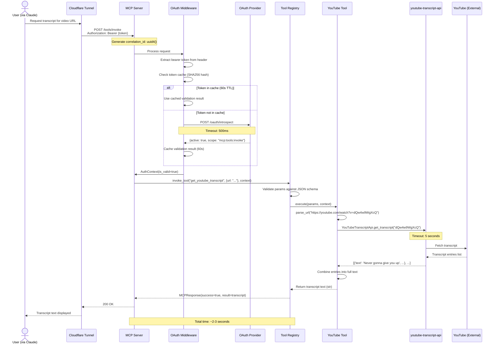
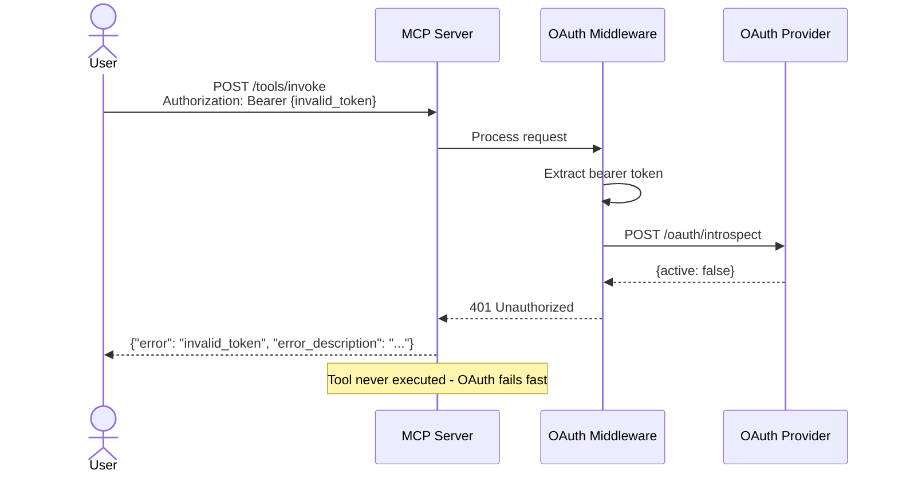
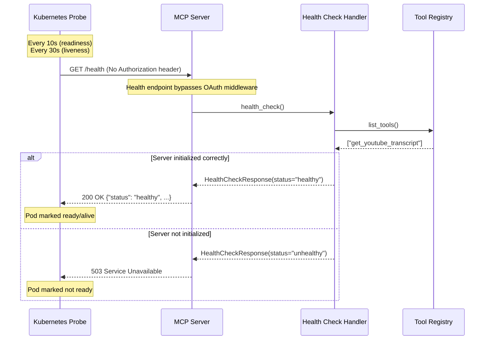

# Core Workflows

## Workflow 1: Successful YouTube Transcript Retrieval (Happy Path)

```mermaid
sequenceDiagram
    actor User as User (via Claude)
    participant CF as Cloudflare Tunnel
    participant Server as MCP Server
    participant OAuth as OAuth Middleware
    participant OAuthProvider as OAuth Provider
    participant Registry as Tool Registry
    participant YTTool as YouTube Tool
    participant YTAPI as youtube-transcript-api
    participant YouTube as YouTube (External)

    User->>CF: Request transcript for video URL
    CF->>Server: POST /tools/invoke<br/>Authorization: Bearer {token}

    Note over Server: Generate correlation_id: uuid4()

    Server->>OAuth: Process request
    OAuth->>OAuth: Extract bearer token from header
    OAuth->>OAuth: Check token cache (SHA256 hash)

    alt Token in cache (60s TTL)
        OAuth->>OAuth: Use cached validation result
    else Token not in cache
        OAuth->>OAuthProvider: POST /oauth/introspect
        Note over OAuth,OAuthProvider: Timeout: 500ms
        OAuthProvider-->>OAuth: {active: true, scope: "mcp:tools:invoke"}
        OAuth->>OAuth: Cache validation result (60s)
    end

    OAuth->>Server: AuthContext(is_valid=true)

    Server->>Registry: invoke_tool("get_youtube_transcript", {url: "..."}, context)
    Registry->>Registry: Validate params against JSON schema
    Registry->>YTTool: execute(params, context)

    YTTool->>YTTool: parse_url("https://youtube.com/watch?v=dQw4w9WgXcQ")
    YTTool->>YTAPI: YouTubeTranscriptApi.get_transcript("dQw4w9WgXcQ")
    Note over YTAPI: Timeout: 5 seconds

    YTAPI->>YouTube: Fetch transcript
    YouTube-->>YTAPI: Transcript entries list
    YTAPI-->>YTTool: [{'text': 'Never gonna give you up', ...}, ...]

    YTTool->>YTTool: Combine entries into full text
    YTTool-->>Registry: Return transcript text (str)
    Registry-->>Server: MCPResponse(success=true, result=transcript)
    Server-->>CF: 200 OK
    CF-->>User: Transcript text displayed

    Note over Server,Registry: Total time: ~2-3 seconds
```

## Workflow 2: OAuth Authentication Failure

```mermaid
sequenceDiagram
    actor User
    participant Server as MCP Server
    participant OAuth as OAuth Middleware
    participant OAuthProvider as OAuth Provider

    User->>Server: POST /tools/invoke<br/>Authorization: Bearer {invalid_token}

    Server->>OAuth: Process request
    OAuth->>OAuth: Extract bearer token
    OAuth->>OAuthProvider: POST /oauth/introspect
    OAuthProvider-->>OAuth: {active: false}

    OAuth-->>Server: 401 Unauthorized
    Server-->>User: {"error": "invalid_token", "error_description": "..."}

    Note over Server: Tool never executed - OAuth fails fast
```

## Workflow 3: Health Check (Kubernetes Probes)

```mermaid
sequenceDiagram
    participant K8s as Kubernetes Probe
    participant Server as MCP Server
    participant Health as Health Check Handler
    participant Registry as Tool Registry

    Note over K8s: Every 10s (readiness)<br/>Every 30s (liveness)

    K8s->>Server: GET /health (No Authorization header)
    Note over Server: Health endpoint bypasses OAuth middleware

    Server->>Health: health_check()
    Health->>Registry: list_tools()
    Registry-->>Health: ["get_youtube_transcript"]

    alt Server initialized correctly
        Health-->>Server: HealthCheckResponse(status="healthy")
        Server-->>K8s: 200 OK {"status": "healthy", ...}
        Note over K8s: Pod marked ready/alive
    else Server not initialized
        Health-->>Server: HealthCheckResponse(status="unhealthy")
        Server-->>K8s: 503 Service Unavailable
        Note over K8s: Pod marked not ready
    end
```

---
